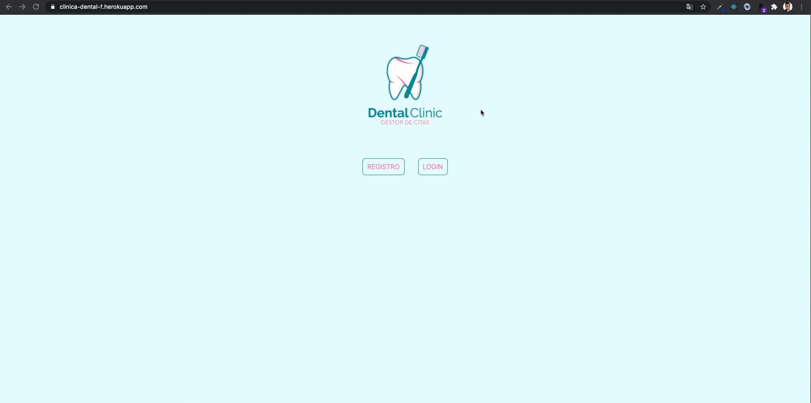

<p align="center">
    	
</p>


# App Clinica Dental
_Este proyecto consiste en la creación de una applicación para la gestión de citas en una clinica dental. Donde un cliente podrá registrarse, logearse si ya esta registrado y gestionar sus propias citas._

## Comenzando 🚀

_Para poder poner en funcionamiento el proyecto en tu maquina local con propositos de desarrollo y pruebas necesitarás instalar las siguiente dependencias:_

```
npm init -y
npm i sass react-router-dom axios

```
_Para ejecutar el programa en tu maquina local:_

```
npm start

```

### Containers 📌
- /home:
    -Tenemos dos opciones donde nos dirige a dos nuevas vistas según si el usuario ya esta registrado o no.
    - /registro (Registro de cliente nuevo)
    - /login (Login cliente ya registrado)
- /login:
    - Disponemos de dos campos para logearnos con email y password correspondiente
- /register:
    - Es el apartado donde nos conducirá en caso de que no estemos registrados.
- /perfil:
    - Una vez registrados o logueados, accederemos al apartado perfil, donde aparecerán las visitas que tenemos pendientes y nos ofrece la opción de crear una nueva cita o cancelar una existente.

## Ejecutando las pruebas ⚙️

* [HEROKU TEST](https://clinica-dental-f.herokuapp.com/)



## Construido con 🛠️

_Tecnologías utilizadas en el proyecto_

- Javascript
- NodeJS
- React
- Heroku
- Git
- GitHub

## Autor ✒️

* **Javier García**  - [javigarcias](https://github.com/javigarcias)

---
⌨️ con ❤️ por [JaviGarcia](https://www.linkedin.com/in/javigarciasanchez/) 😊